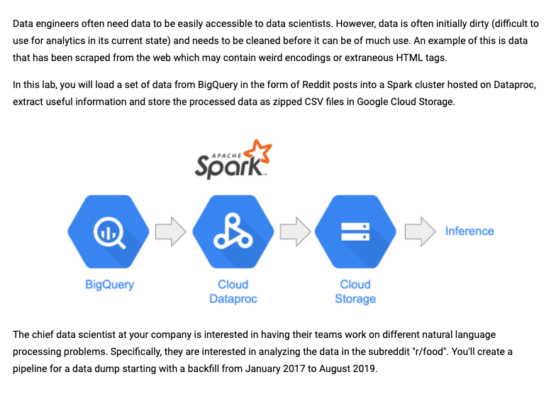
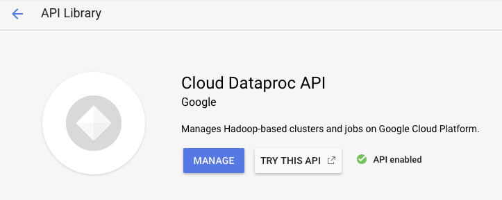
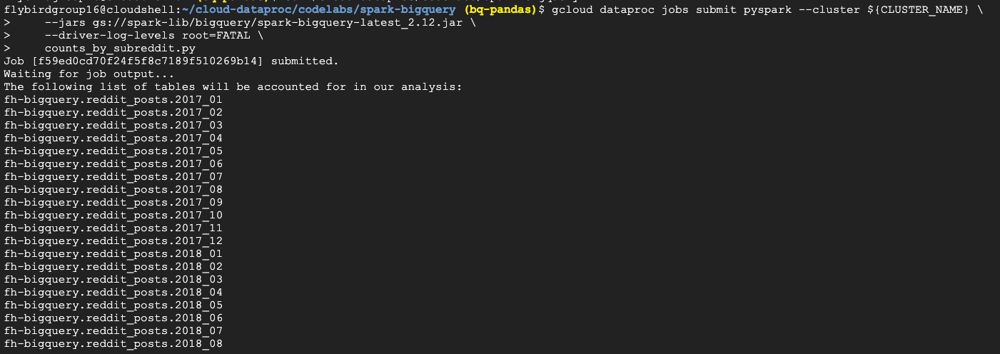
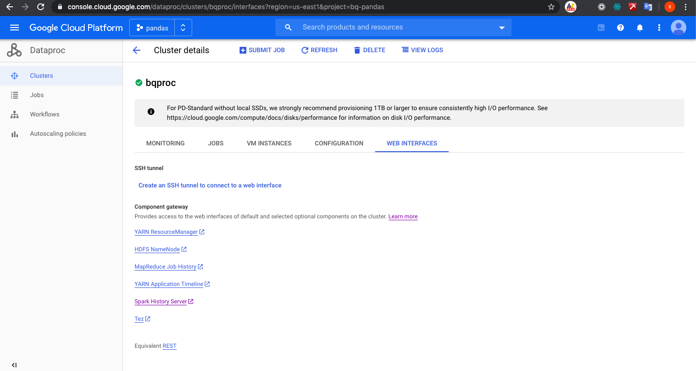
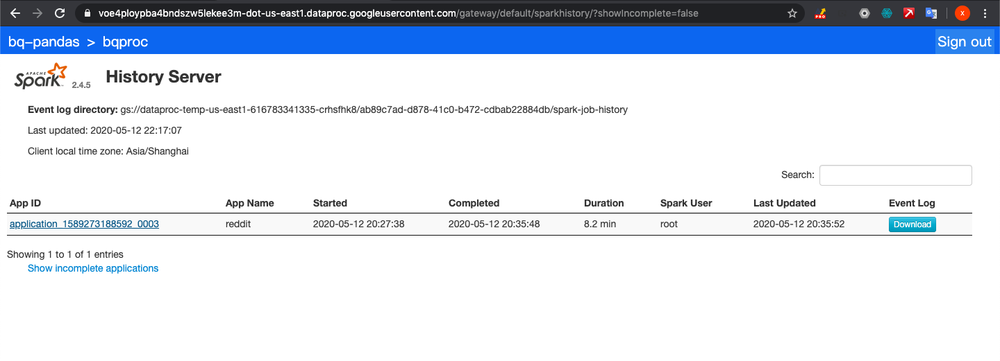
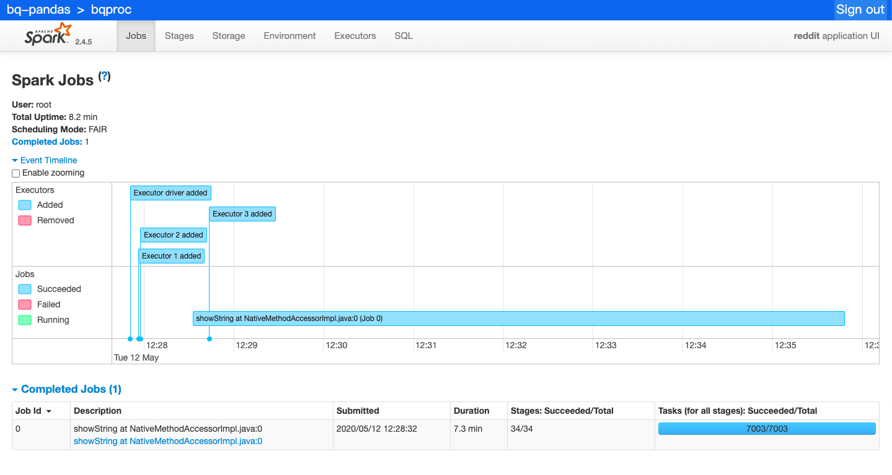

我们运用数据分析的时候,通常都是脏数据,我们需要清洗才能被使用.
我们可以加载Big query的数据放到Dataproc中,通过spark集群来etl有用的数据,然后把一些processed data比如zipped csv file放到google gloud storage上


# 准备阶段
## 去到控制台,确认cloud dataproc API已启用
<!--truncate-->




# 我们会使用命令去dataproc创建集群

## 首先我们创建一个yaml文件,对集群做自动伸缩的定义
[关于spark自动伸缩原理](https://cloud.google.com/dataproc/docs/concepts/configuring-clusters/autoscaling#autoscaling_and_spark_structured_streaming)
```
workerConfig:
  minInstances: 2
  maxInstances: 100
  weight: 1
secondaryWorkerConfig:
  minInstances: 0
  maxInstances: 100
  weight: 1
basicAlgorithm:
  cooldownPeriod: 4m
  yarnConfig:
    scaleUpFactor: 1
    scaleDownFactor: 1.0
    scaleUpMinWorkerFraction: 0.0
    scaleDownMinWorkerFraction: 0.0
    gracefulDecommissionTimeout: 1h
```

然后我们可以先创建自动伸缩政策
```
gcloud beta dataproc autoscaling-policies import policy-name --source policy-file.yaml
```
[具体的command命令](https://cloud.google.com/sdk/gcloud/reference/beta/dataproc/autoscaling-policies)

## 创建集群
```
CLUSTER_NAME=newnew
gcloud beta dataproc clusters create ${CLUSTER_NAME} \
    --region=global \
    --zone=us-central1-b \
    --worker-machine-type n1-standard-1 \
    --num-workers 2 \
    --image-version 1.4-debian \
    --initialization-actions gs://dataproc-initialization-actions/python/pip-install.sh \
    --metadata 'PIP_PACKAGES=google-cloud-storage avro-python3 dask[dataframe] gcsfs fastavro' \
    --enable-component-gateway \
    --worker-boot-disk-size=40 \
    --optional-components=JUPYTER,ANACONDA \
    --enable-component-gateway \
    --autoscaling-policy=global
```

## 创建成功后,Dataprocmenu上查看,同时我们需要创建一个GCS,这样我们处理好的数据就可以存在在GCS上了
```
BUCKET_NAME=<bucket_name>
gsutil mb gs://${BUCKET_NAME}
```

## 我们可以去bigquery的public data找数据,查看表的数据结构


## 运行 pyspark job
```
cd
git clone https://github.com/GoogleCloudPlatform/cloud-dataproc
```
```
cd ~/cloud-dataproc/codelabs/spark-bigquery
gcloud dataproc jobs submit pyspark --cluster ${CLUSTER_NAME} \
    --jars gs://spark-lib/bigquery/spark-bigquery-latest_2.12.jar \
    --driver-log-levels root=FATAL \
    counts_by_subreddit.py
```
我们需要提供集群名字,提供jars的参数,这个jar包能够允许我们通过saprk-bigquery-connector连接到我们的job,
driver-log-levels root=FATAL能够抑制日志输出除了错误信息,因为spark logs.



## 我们查看Dataproc和spark





## 我们跑一个任务,加载数据到memory,提取必须要的信息,然后输出到GCS里面.我们这里是提取title,body和timestamp created,然后我们把这些data转成csv文件,存入gcs里面
```
cd ~/cloud-dataproc/codelabs/spark-bigquery
bash backfill.sh ${CLUSTER_NAME} ${BUCKET_NAME}
```

查看
```
gsutil ls gs://${BUCKET_NAME}/reddit_posts/*/*/food.csv.gz
```

(类似的实验可以参考)(https://codelabs.developers.google.com/codelabs/pyspark-bigquery/index.html?index=..%2F..index#1)

